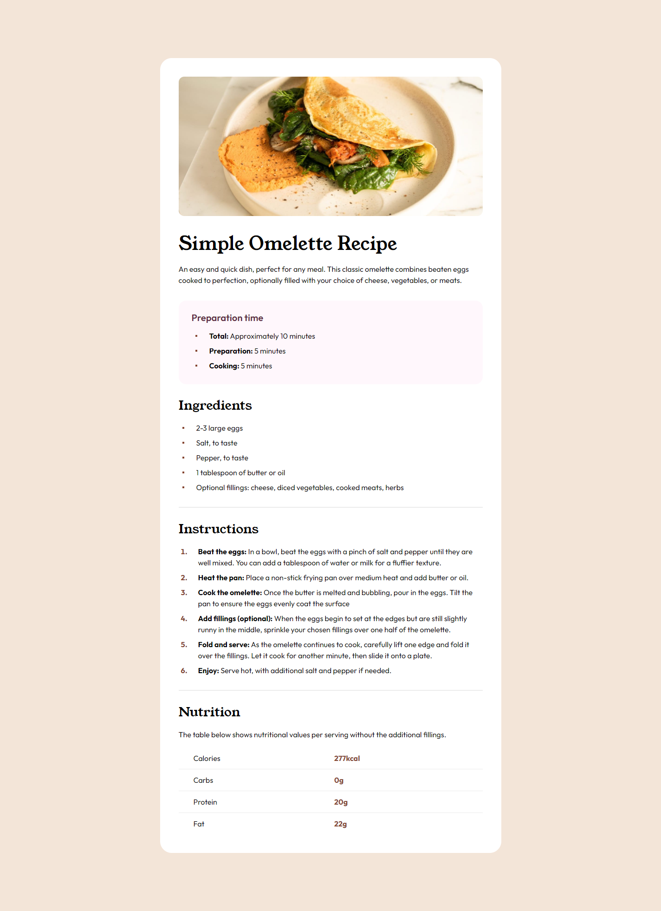
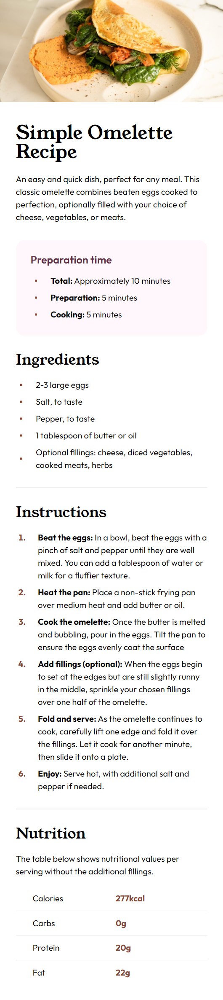

<h1 align="center" style="margin: 0">Recipe Page</h1>

Solution to the Frontend Mentor challenge

This is a solution to the <a href="https://www.frontendmentor.io/challenges/recipe-page-KiTsR8QQKm">FAQ accordion challenge on Frontend Mentor</a>. Frontend Mentor challenges help you improve your coding skills by building realistic projects.

## Screenshots

### Desktop view

### Mobile view

## Links

- Live Site URL ⇒ https://recipe-page-km.netlify.app

### Built with

- HTML5
- CSS